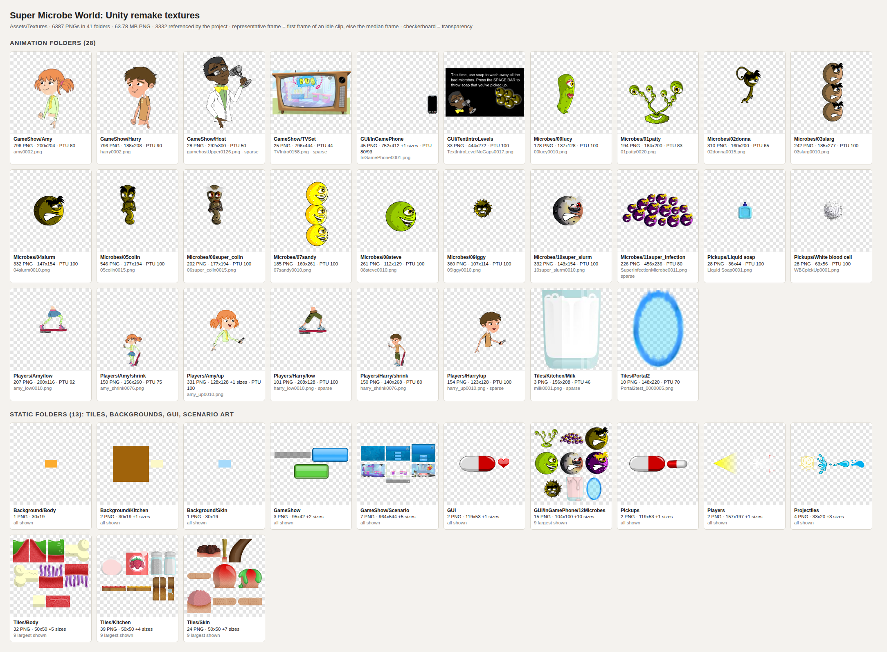

# Unity remake asset catalogue

Generated 2026-09-26 from `Assets/` in this repo (the 2013-14 Unity remake). Machine-readable companion: [`unity-assets.json`](unity-assets.json), which also holds every frame's size, alpha bounding box and whether anything in the project references it. Visual index: [`unity-contact-sheet.png`](unity-contact-sheet.png).

How it was measured: frame sizes come from each PNG's IHDR header. Every PNG was also fully decoded with a small built-in decoder (all files are 8-bit, non-interlaced RGB or RGBA) to find its alpha bounding box, so the "trimmed" figures are exact. "Referenced" means that the texture's GUID appears in a `.anim`, `.controller`, `.prefab`, `.unity` scene or `Resources` asset. Sizes are file bytes (1 MB = 1,048,576 bytes). `du -sh Assets/Textures` reports about 104 MB only because roughly 12,800 small files (PNGs plus `.meta`) are each rounded up to a 4 KB disk block.

## Headline numbers

| Measure | Value |
|---|---|
| PNG files under Assets/Textures | 6387 in 41 folders |
| Of which numbered-sequence frames | 6268 |
| Animation folders (frames driven by clips, or 20+ numbered frames) | 28 |
| PNG bytes | 63.78 MB |
| PNGs referenced anywhere in the project | 3332 (40.24 MB). The other 3055 files (23.5 MB) are never used |
| Decoded RGBA, full frames | 917.2 MB |
| Decoded RGBA, trimmed to alpha bounds | 346.2 MB (all files); 217.5 MB (referenced files only) |
| Animation clips / Animator controllers | 188 / 31 |
| Prefabs | 78 |
| Fonts | 3 |

## Groups

| Group | Folders | PNGs | Sequence frames | Frame sizes (px, ×count) | PNG MB | Referenced PNGs (MB) | RGBA MB full → trimmed |
|---|---:|---:|---:|---|---:|---:|---|
| microbe | 12 | 3368 | 3368 | 177x194×748, 107x114×360, 147x154×332, 143x154×332, +7 more | 27.8 | 1822 (19.06) | 432.2 → 117.0 |
| gameshow | 6 | 1655 | 1648 | 200x204×796, 188x208×796, 292x300×28, 796x444×25, +9 more | 23.22 | 497 (11.32) | 302.8 → 152.0 |
| character | 7 | 1095 | 1092 | 128x128×330, 200x116×207, 123x128×154, 156x260×150, +5 more | 8.9 | 763 (6.13) | 111.3 → 44.9 |
| tile | 5 | 108 | 28 | 50x50×56, 148x220×10, 100x100×8, 100x50×8, +12 more | 1.42 | 94 (1.32) | 3.7 → 3.6 |
| gui | 4 | 95 | 76 | 752x412×43, 444x272×33, 104x100×3, 32x32×2, +12 more | 2.24 | 94 (2.22) | 66.5 → 28.2 |
| pickup | 3 | 58 | 56 | 36x44×28, 63x56×28, 119x53×1, 51x22×1 | 0.17 | 56 (0.17) | 0.6 → 0.5 |
| background | 3 | 4 | 0 | 30x19×3, 100x100×1 | 0.01 | 4 (0.01) | 0.0 → 0.0 |
| projectile | 1 | 4 | 0 | 33x20×1, 50x16×1, 25x50×1, 40x38×1 | 0.01 | 2 (0.01) | 0.0 → 0.0 |

## Size of each top-level Textures folder

| Folder | PNGs | PNG MB | On disk incl. .meta/.txt (MB) | Referenced PNGs (MB) | RGBA MB full → trimmed |
|---|---:|---:|---:|---:|---|
| Assets/Textures/Background | 4 | 0.01 | 0.01 | 4 (0.01) | 0.0 → 0.0 |
| Assets/Textures/GameShow | 1655 | 23.22 | 24.82 | 497 (11.32) | 302.8 → 152.0 |
| Assets/Textures/GUI | 95 | 2.24 | 2.33 | 94 (2.22) | 66.5 → 28.2 |
| Assets/Textures/Microbes | 3368 | 27.81 | 30.81 | 1822 (19.06) | 432.2 → 117.0 |
| Assets/Textures/Pickups | 58 | 0.18 | 0.23 | 56 (0.17) | 0.6 → 0.5 |
| Assets/Textures/Players | 1095 | 8.9 | 9.95 | 763 (6.13) | 111.3 → 44.9 |
| Assets/Textures/Projectiles | 4 | 0.01 | 0.01 | 2 (0.01) | 0.0 → 0.0 |
| Assets/Textures/Tiles | 108 | 1.41 | 1.51 | 94 (1.32) | 3.7 → 3.6 |

## Texture folders

PTU is `spritePixelsToUnits` from the `.meta` files. Every scene camera is orthographic with size 5, so the view is 10 world units tall. At PTU 100 that is 1,000 source pixels, which means a sprite with PTU *p* is drawn at 100/*p* × its pixel size in a 1,000-px-tall view. Prefab and scene transforms can scale it further. The "alpha bounds" column is the union of opaque pixels across the folder's main sequence (x,y,w,h).

| Folder | Kind | PNGs | Frame size(s) | Naming pattern | Numbering | PTU | Alpha bounds (union) | Referenced / by clips | PNG MB | Range txt |
|---|---|---:|---|---|---|---|---|---|---:|---|
| Background/Body | static images | 1 | 30x19 | — | named files only (1) | 100: 1 | 0,0,30×19 | 1 / 0 | 0 |  |
| Background/Kitchen | static images | 2 | 30x19×1, 100x100×1 | — | named files only (2) | 100: 2 | 0,0,100×100 | 2 / 0 | 0.01 |  |
| Background/Skin | static images | 1 | 30x19 | — | named files only (1) | 100: 1 | 0,0,30×19 | 1 / 0 | 0 |  |
| GameShow | static images | 3 | 95x42×1, 300x115×1, 477x81×1 | — | named files only (3) | 100: 3 | 0,0,477×115 | 3 / 0 | 0.01 |  |
| GameShow/Amy | clip-animated sequence | 796 | 200x204 | `amy0001..0796.png` | contiguous 796 | 80: 796 | 4,23,187×177 | 221 / 220 | 8.88 | `amy frame anims.txt` |
| GameShow/Harry | clip-animated sequence | 796 | 188x208 | `harry0001..0796.png` | contiguous 796 | 90: 796 | 4,16,180×187 | 217 / 216 | 7.46 | `harry frame anims.txt` |
| GameShow/Host | clip-animated sequence | 28 | 292x300 | `gamehostUpper0001..0360.png` | **sparse**: 28 of 360 | 50: 28 | 4,8,287×278 | 26 / 26 | 0.75 | `gamehost.txt` |
| GameShow/Scenario | static images + small numbered variant set | 7 | 964x544×2, 1282x786×1, 1282x787×1, +3 more | `DonnaQuiz1..3.png` | contiguous 3<br>+4 other | 100: 6, 80: 1 | 0,0,1282×787 | 5 / 0 | 0.7 |  |
| GameShow/TVSet | clip-animated sequence | 25 | 796x444 | `TVIntro0002..0170.png` | **sparse**: 25 of 169 | 44: 25 | 0,0,796×444 | 25 / 25 | 5.42 |  |
| GUI | static images (some used as clip keys) | 2 | 119x53×1, 32x30×1 | — | named files only (2) | 100: 2 | 0,0,119×53 | 2 / 1 | 0 |  |
| GUI/InGamePhone | clip-animated sequence | 45 | 752x412×43, 32x32×2 | `InGamePhone0001..0043.png` | contiguous 43<br>+2 other | 93: 43, 80: 2 | 0,0,752×412 | 45 / 43 | 1.03 |  |
| GUI/InGamePhone/12Microbes | static images | 15 | 104x100×3, 68x100×2, 44x100×2, +8 more | — | named files only (15) | 80: 11, 100: 2, 70: 1, 85: 1 | 0,0,126×100 | 14 / 0 | 0.18 |  |
| GUI/TextIntroLevels | numbered sequence (no clip uses it) | 33 | 444x272 | `TextIntroLevelNoGaps0001..0033.png` | contiguous 33 | 100: 33 | 0,0,443×272 | 33 / 0 | 1.03 |  |
| Microbes/00lucy | clip-animated sequence | 178 | 137x128 | `00lucy0001..0178.png` | contiguous 178 | 100: 178 | 7,2,115×118 | 167 / 167 | 0.84 |  |
| Microbes/01patty | clip-animated sequence | 194 | 184x200 | `01patty0001..0194.png` | contiguous 194 | 83: 194 | 4,8,176×173 | 113 / 112 | 2.01 |  |
| Microbes/02donna | clip-animated sequence | 310 | 160x200 | `02donna0001..0310.png` | contiguous 310 | 65: 310 | 7,2,146×197 | 132 / 131 | 1.22 |  |
| Microbes/03slarg | clip-animated sequence | 242 | 185x277 | `03slarg0001..0242.png` | contiguous 242 | 100: 242 | 6,8,179×269 | 84 / 83 | 3.34 |  |
| Microbes/04slurm | clip-animated sequence | 332 | 147x154 | `04slurm0001..0332.png` | contiguous 332 | 100: 332 | 18,4,123×150 | 153 / 152 | 1.33 |  |
| Microbes/05colin | clip-animated sequence | 546 | 177x194 | `05colin0001..0546.png` | contiguous 546 | 100: 546 | 2,1,167×193 | 223 / 222 | 2.1 |  |
| Microbes/06super_colin | clip-animated sequence | 202 | 177x194 | `06super_colin0001..0202.png` | contiguous 202 | 100: 202 | 2,1,167×193 | 188 / 187 | 1.47 |  |
| Microbes/07sandy | clip-animated sequence | 185 | 160x261 | `07sandy0001..0185.png` | contiguous 185 | 100: 185 | 13,9,138×242 | 93 / 92 | 2.14 |  |
| Microbes/08steve | clip-animated sequence | 261 | 112x129 | `08steve0001..0261.png` | contiguous 261 | 100: 261 | 12,5,94×113 | 129 / 128 | 1.1 |  |
| Microbes/09iggy | clip-animated sequence | 360 | 107x114 | `09iggy0001..0360.png` | contiguous 360 | 100: 360 | 2,2,99×112 | 160 / 159 | 1.17 |  |
| Microbes/10super_slurm | clip-animated sequence | 332 | 143x154 | `10super_slurm0001..0332.png` | contiguous 332 | 100: 332 | 12,4,124×150 | 154 / 153 | 2.55 |  |
| Microbes/11super_infection | clip-animated sequence | 226 | 456x236 | `SuperInfectionMicrobe0011..0285.png` | **sparse**: 226 of 275 | 80: 226 | 12,7,430×209 | 226 / 226 | 8.53 | `SuperInfectionMicrobes.txt` |
| Pickups | static images | 2 | 119x53×1, 51x22×1 | — | named files only (2) | 100: 2 | 0,0,119×53 | 1 / 0 | 0 |  |
| Pickups/Liquid soap | clip-animated sequence | 28 | 36x44 | `Liquid Soap0001..0028.png` | contiguous 28 | 100: 28 | 1,0,34×42 | 27 / 27 | 0.06 |  |
| Pickups/White blood cell | clip-animated sequence | 28 | 63x56 | `WBCpickUp0001..0028.png` | contiguous 28 | 100: 28 | 1,0,61×53 | 28 / 28 | 0.11 |  |
| Players | static images | 2 | 157x197×1, 101x101×1 | — | named files only (2) | 100: 2 | 8,4,135×159 | 1 / 0 | 0.01 |  |
| Players/Amy/low | clip-animated sequence | 207 | 200x116 | `amy_low0001..0207.png` | contiguous 207 | 92: 207 | 10,0,182×111 | 101 / 100 | 1.07 | `amy_low.AnimFrames.txt` |
| Players/Amy/shrink | clip-animated sequence | 150 | 156x260 | `amy_shrink0001..0150.png` | contiguous 150 | 75: 150 | 2,15,143×243 | 150 / 150 | 1.82 |  |
| Players/Amy/up | clip-animated sequence | 331 | 128x128×330, 1024x2048×1 | `amy_up0001..0330.png` | contiguous 330<br>+1 other | 100: 331 | 6,12,120×113 | 130 / 129 | 3.05 | `amy_up.AnimFrames.txt` |
| Players/Harry/low | clip-animated sequence | 101 | 208x128 | `harry_low0001..0207.png` | **sparse**: 101 of 207 | 100: 101 | 3,4,196×98 | 101 / 100 | 0.6 |  |
| Players/Harry/shrink | clip-animated sequence | 150 | 140x268 | `harry_shrink0001..0150.png` | contiguous 150 | 80: 150 | 2,14,136×254 | 150 / 149 | 1.51 |  |
| Players/Harry/up | clip-animated sequence | 154 | 123x128 | `harry_up0001..0330.png` | **sparse**: 154 of 330 | 100: 154 | 7,14,115×113 | 130 / 129 | 0.84 |  |
| Projectiles | static images (some used as clip keys) | 4 | 33x20×1, 50x16×1, 25x50×1, +1 more | — | named files only (4) | 100: 4 | 0,0,50×50 | 2 / 2 | 0.01 |  |
| Tiles/Body | static images + small numbered variant set | 32 | 50x50×21, 100x100×4, 100x150×2, +3 more | `flesh_gristle_1..6.png` | contiguous 6<br>+26 other | 100: 32 | 0,0,100×150 | 27 / 0 | 0.32 |  |
| Tiles/Kitchen | static images + small numbered variant set | 39 | 50x50×27, 50x200×6, 100x200×2, +2 more | `Chop_Mid1..3.png`<br>`Unit_1..6.png` | contiguous 3<br>contiguous 6<br>+30 other | 100: 39 | 0,0,250×200 | 35 / 0 | 0.36 |  |
| Tiles/Kitchen/Milk | clip-animated sequence | 3 | 156x208 | `milk0001..0060.png` | **sparse**: 3 of 60 | 46: 3 | 0,0,156×208 | 3 / 3 | 0.05 |  |
| Tiles/Portal2 | clip-animated sequence | 10 | 148x220 | `Portal2test_0000000..0000009.png` | contiguous 10 | 70: 10 | 0,0,148×219 | 10 / 10 | 0.46 |  |
| Tiles/Skin | static images | 24 | 50x50×8, 100x50×6, 100x100×4, +5 more | — | named files only (24) | 100: 24 | 0,0,200×250 | 19 / 0 | 0.23 |  |

### Sparse sequences (missing frame numbers)

These folders do not hold every Flash frame. Roughly, only the frames named in the range files or used by the Unity clips were exported (Harry/up also keeps the tractor-beam frames 195-237, which no clip uses). Frame numbers in the range files are Flash timeline frame numbers, so any decimation or atlas plan must key on the number in the file name, never on the array index.

- **GameShow/Host** `gamehostUpper0001..0360.png`: 28 files spanning 360 frames. Present: 1-2, 11, 24, 44, 70, 73-74, 80, 85, 89, 91, 103, 115, 126, 128, 138, 151, 171, 197, 218, 239, 253, 279, 300, 332, 359-360.
- **GameShow/TVSet** `TVIntro0002..0170.png`: 25 files spanning 169 frames. Present: 2, 25, 49, 120, 135, 151-170.
- **Microbes/11super_infection** `SuperInfectionMicrobe0011..0285.png`: 226 files spanning 275 frames. Present: 11-33, 37-67, 80-102, 105-133, 145-167, 180-210, 215-234, 240-285.
- **Players/Harry/low** `harry_low0001..0207.png`: 101 files spanning 207 frames. Present: 1, 10-29, 47-55, 70-75, 84-92, 105-111, 119-126, 136-140, 150-156, 165-180, 195-207.
- **Players/Harry/up** `harry_up0001..0330.png`: 154 files spanning 330 frames. Present: 1, 10-29, 47-55, 70-75, 84-92, 102-108, 115-122, 137-143, 155-162, 171-178, 195-201, 213-220, 229-237, 255-267, 280-298, 316-330.
- **Tiles/Kitchen/Milk** `milk0001..0060.png`: 3 files spanning 60 frames. Present: 1, 25, 60.

### Files outside numbered sequences

- **GameShow/Scenario**: `Background.png (964x544)`, `Foreground.png (964x544)`, `ShrinkingZone.png (848x480)`, `talkie.png (914x172)`
- **GUI/InGamePhone**: `200px-P_no_red.svg.png (32x32)`, `200px-P_yes_green.svg.png (32x32)`
- **Players/Amy/up**: `amy_up_test.png (1024x2048)`
- **Tiles/Body**: `acid_pit_end.png (100x150)`, `acid_pit_mid.png (100x148)`, `acid_pit_start.png (100x150)`, `bone_end.png (100x100)`, `bone_mid.png (50x100)`, `bone_start.png (100x100)`, `bubble.png (50x50)`, `cell_front.png (50x50)`, `cell_side.png (50x50)`, `corner_l.png (50x50)`, `corner_r.png (50x50)`, `flesh.png (50x50)`, `floor_a.png (50x50)`, `floor_b.png (50x50)`, `platform_bridge.png (50x50)`, `platform_end.png (50x50)`, `platform_mid.png (100x50)`, `platform_start.png (50x50)`, `roof_a.png (50x50)`, `roof_b.png (50x50)`, `vertical_a_l.png (50x50)`, `vertical_a_r.png (50x50)`, `vertical_b_l.png (50x50)`, `vertical_b_r.png (50x50)`, `villi_floor.png (100x100)`, `villi_roof.png (100x100)`
- **Tiles/Kitchen**: `C_Chip_L.png (50x50)`, `C_Chip_Mid.png (50x50)`, `C_Chip_R.png (50x50)`, `Cheese_L.png (50x50)`, `Cheese_Mid.png (50x50)`, `Cheese_R.png (50x50)`, `Chip_L.png (50x50)`, `Chip_Mid.png (50x50)`, `Chip_R.png (50x50)`, `Chop_L.png (50x50)`, `Chop_R.png (50x50)`, `loaf_end_left.png (50x200)`, `loaf_end_right.png (50x200)`, `loaf_mid_mould.png (50x200)`, `loaf_mid_mould2.png (50x200)`, `loaf_mid_mould3.png (50x200)`, `loaf_mid.png (50x200)`, `pepper.png (100x200)`, `salt.png (100x200)`, `Sausage_L.png (50x50)`, `Sausage_Mid.png (50x50)`, `Sausage_R.png (50x50)`, `Sugar.png (50x50)`, `toast_jam.png (250x50)`, `toast_marm.png (250x50)`, `Yog_L.png (50x50)`, `Yog_Mid.png (50x50)`, `Yog_R.png (50x50)`, `yoghurt_lid.png (150x150)`, `yoghurt.png (150x150)`
- Folders made only of individually named images (tiles, backgrounds, GUI icons, scenario art): Background/Body (1), Background/Kitchen (2), Background/Skin (1), GameShow (3), GUI (2), GUI/InGamePhone/12Microbes (15), Pickups (2), Players (2), Projectiles (4), Tiles/Skin (24). Their full file lists are in the JSON under `textureFolders[].frames`.

### Fully transparent frames

Flash exported every timeline frame, including the blank gaps between labelled animations. These files decode to zero opaque pixels:

- Microbes/00lucy: 6 of 178
- Microbes/01patty: 8 of 194
- Microbes/02donna: 30 of 310
- Microbes/03slarg: 16 of 242
- Microbes/04slurm: 67 of 332
- Microbes/05colin: 178 of 546
- Microbes/06super_colin: 1 of 202
- Microbes/07sandy: 15 of 185
- Microbes/08steve: 25 of 261
- Microbes/09iggy: 42 of 360
- Microbes/10super_slurm: 13 of 332

## Animation range text files

Each file is reproduced verbatim (tabs kept), followed by a comparison with the Unity clips that use that folder. A clip range is the lowest and highest frame number that the clip's sprite keys reference.

### GameShow/Amy/amy frame anims.txt

```text
Amy
animation			|frames

stop				|1
idle				|2-41
neutral				|43-167
cautious			|168-292
confident			|293-417
happy				|418-543
disappointed			|544-668
curious				|671-796
```

| Entry | Txt range | Files present in range | Matched clip | Clip range | Clip keys | Agrees |
|---|---|---:|---|---|---:|---|
| stop | 1-1 | 1/1 | — | — | — | **no** |
| idle | 2-41 | 40/40 | amy_idle | 2-41 | 41 | yes |
| neutral | 43-167 | 125/125 | amy_neutral | 43-167 | 6 | yes |
| cautious | 168-292 | 125/125 | amy_cautious | 168-292 | 6 | yes |
| confident | 293-417 | 125/125 | amy_confident | 293-383 | 6 | **no** |
| happy | 418-543 | 126/126 | amy_happy | 418-543 | 126 | yes |
| disappointed | 544-668 | 125/125 | amy_disappointed | 544-668 | 6 | yes |
| curious | 671-796 | 126/126 | amy_curious | 671-795 | 31 | **no** |

### GameShow/Harry/harry frame anims.txt

```text
Amy
animation			|frames

stop				|10
idle				|2-42
neutral				|3-167
cautious			|168-292
confident			|293-417
happy				|418-453
disappointed			|544-668
curious				|671-796
```

| Entry | Txt range | Files present in range | Matched clip | Clip range | Clip keys | Agrees |
|---|---|---:|---|---|---:|---|
| stop | 10-10 | 1/1 | — | — | — | **no** |
| idle | 2-42 | 41/41 | harry_idle | 2-42 | 41 | yes |
| neutral | 3-167 | 165/165 | harry_neutral | 43-135 | 6 | **no** |
| cautious | 168-292 | 125/125 | harry_cautious | 176-259 | 5 | **no** |
| confident | 293-417 | 125/125 | harry_confident | 300-383 | 5 | **no** |
| happy | 418-453 | 36/36 | harry_happy | 418-543 | 126 | **no** |
| disappointed | 544-668 | 125/125 | harry_disappointed | 544-639 | 7 | **no** |
| curious | 671-796 | 126/126 | harry_curious | 671-795 | 31 | **no** |

### GameShow/Host/gamehost.txt

```text
Host animation frames

stop		1
excited		2-125
serious		128-250
disappointed	253-378
```

| Entry | Txt range | Files present in range | Matched clip | Clip range | Clip keys | Agrees |
|---|---|---:|---|---|---:|---|
| stop | 1-1 | 1/1 | hostStop | 1-1 | 2 | yes |
| excited | 2-125 | 13/124 | hostExcited | 2-115 | 14 | **no** |
| serious | 128-250 | 7/123 | hostSerious | 128-239 | 8 | **no** |
| disappointed | 253-378 | 6/126 | hostDisappointed | 253-359 | 6 | **no** |

### Microbes/11super_infection/SuperInfectionMicrobes.txt

```text
Frame animations:
		Starts	end 
Idle 1 : 	11	33
be_hit_1: 	37	67
idle_2: 	80	102
be_hit_2	105	133
idle_3		145	167
be_hit_3	180	210
idle_4		215	234
be_killed	240	285
```

| Entry | Txt range | Files present in range | Matched clip | Clip range | Clip keys | Agrees |
|---|---|---:|---|---|---:|---|
| Idle 1 | 11-33 | 23/23 | idle1 | 11-33 | 23 | yes |
| be_hit_1 | 37-67 | 31/31 | hit1 | 37-67 | 31 | yes |
| idle_2 | 80-102 | 23/23 | idle2 | 80-102 | 23 | yes |
| be_hit_2 | 105-133 | 29/29 | hit2 | 105-133 | 29 | yes |
| idle_3 | 145-167 | 23/23 | idle3 | 145-167 | 23 | yes |
| be_hit_3 | 180-210 | 31/31 | hit3 | 180-210 | 31 | yes |
| idle_4 | 215-234 | 20/20 | idle4 | 215-234 | 20 | yes |
| be_killed | 240-285 | 46/46 | hit4 | 240-285 | 46 | yes |

### Players/Amy/low/amy_low.AnimFrames.txt

```text
amy_low	(24 fps)	| Frames	| Duration (number of frames)

stop			| 1-9		| 8

idle			| 10-29		| 20

move			| 47-55		| 9

accelerate_start	| 70-75		| 6

accelerate_mid		| 84-92		| 9

decelerate_start	| 105-111	| 7

decelerate_mid		| 119-126	| 8

jump_start		| 136-140	| 5

jump_mid		| 150-156	| 7

jump_end		| 165-180	| 11

hurt			| 195-207	| 13
```

| Entry | Txt range | Files present in range | Matched clip | Clip range | Clip keys | Agrees |
|---|---|---:|---|---|---:|---|
| stop | 1-9 | 9/9 | — | — | — | **no** |
| idle | 10-29 | 20/20 | idle | 10-29 | 20 | yes |
| move | 47-55 | 9/9 | move | 47-55 | 9 | yes |
| accelerate_start | 70-75 | 6/6 | accelerate_start | 70-75 | 6 | yes |
| accelerate_mid | 84-92 | 9/9 | accelerate_mid | 84-92 | 9 | yes |
| decelerate_start | 105-111 | 7/7 | decelerate_start | 105-111 | 7 | yes |
| decelerate_mid | 119-126 | 8/8 | decelerate_mid | 119-126 | 8 | yes |
| jump_start | 136-140 | 5/5 | jump_start | 136-140 | 5 | yes |
| jump_mid | 150-156 | 7/7 | jump_mid | 150-156 | 7 | yes |
| jump_end | 165-180 | 16/16 | jump_end | 165-180 | 16 | yes |
| hurt | 195-207 | 13/13 | hurt | 195-207 | 13 | yes |

### Players/Amy/up/amy_up.AnimFrames.txt

```text
amy_up (24 frames per second)	| Frames	| Duration (number of frames)

stop				| 1-9		| 8

idle				| 10-29		| 20

move				| 47-55		| 9

accelerate_start		| 70-75		| 6

accelerate_mid			| 84-92		| 9

decelerate_start		| 102-108	| 7

decelerate_mid			| 115-122	| 8

take_photo_start		| 137-143	| 7

take_photo_mid			| 155-162	| 7

take_photo_end			| 171-178	| 8

use_tractor_beam_start		| 195-201	| 

use_tractor_beam_mid		| 213-220	| 

use_tractor_beam_end		| 229-237	| 

hurt				| 255-267	| 13

shoot_soap			| 280-298	| 19

throw_white_blood_cell		| 316-330	| 15
```

| Entry | Txt range | Files present in range | Matched clip | Clip range | Clip keys | Agrees |
|---|---|---:|---|---|---:|---|
| stop | 1-9 | 9/9 | — | — | — | **no** |
| idle | 10-29 | 20/20 | idle | 10-29 | 20 | yes |
| move | 47-55 | 9/9 | move | 47-55 | 9 | yes |
| accelerate_start | 70-75 | 6/6 | accelerate_start | 70-75 | 6 | yes |
| accelerate_mid | 84-92 | 9/9 | accelerate_mid | 84-92 | 9 | yes |
| decelerate_start | 102-108 | 7/7 | decelerate_start | 102-108 | 7 | yes |
| decelerate_mid | 115-122 | 8/8 | decelerate_mid | 115-122 | 8 | yes |
| take_photo_start | 137-143 | 7/7 | take_photo_start | 137-143 | 7 | yes |
| take_photo_mid | 155-162 | 8/8 | take_photo_mid | 155-162 | 8 | yes |
| take_photo_end | 171-178 | 8/8 | take_photo_end | 171-178 | 8 | yes |
| use_tractor_beam_start | 195-201 | 7/7 | — | — | — | **no** |
| use_tractor_beam_mid | 213-220 | 8/8 | — | — | — | **no** |
| use_tractor_beam_end | 229-237 | 9/9 | — | — | — | **no** |
| hurt | 255-267 | 13/13 | hurt | 255-267 | 13 | yes |
| shoot_soap | 280-298 | 19/19 | shoot_soap | 280-298 | 19 | yes |
| throw_white_blood_cell | 316-330 | 15/15 | throw_whiteb_cell | 316-330 | 15 | yes |

### Discrepancies worth knowing

- **`harry frame anims.txt` is a badly edited copy of Amy's file.** Its header still says "Amy", and it gives `stop |10`, `idle |2-42`, `neutral |3-167` (this overlaps idle) and `happy |418-453` (only 36 frames). The Harry clips and the 796 files follow the same layout as Amy: idle 2-42, neutral 43-167, happy 418-543, curious 671-796. Trust the clips and Amy's file, not this one.
- **The game-show emotion clips (Amy, Harry, Host) are heavy decimations.** The Flash timelines have 125 frames per emotion (about 5 s at the 24 fps that `amy_up.AnimFrames.txt` states), and all of those frames exist as PNGs. Unity plays only 5-7 hand-picked poses at 5 fps for neutral, cautious, confident and disappointed. Happy is full at 24 fps, idle is full at 12 or 24 fps, and curious plays 27 frames and then 4 held poses. `amy_confident` stops at frame 383 (the txt says 417) and repeats its last pose.
- **`gamehost.txt` runs to frame 378, but only 28 host files exist (the highest is `gamehostUpper0360`).** The host clips are sparse pose flips at 12 fps (hold lengths are listed below).
- **The SuperInfection range file matches the clips exactly.** Its `be_killed` range (240-285) is the clip `hit4`, not a separate death clip. Frames 1-10 were never exported.
- **The amy_up tractor-beam ranges (195-237) exist as PNGs but no clip uses them.** The Unity remake has no tractor-beam animation. `Players/Final Tractor Beam.png` is a separate static image.
- **No Unity clip plays the `stop` frames (1-9 for the players, 1 for the game-show characters), except `hostStop` (host frame 1).** Where a stop frame is referenced at all, it is as the initial sprite in a prefab or scene.
- **Harry has no range files.** His clips use exactly the same frame ranges as Amy's. His up and low folders are sparse: 154 of 330 and 101 of 207 frame numbers exist, mostly the frames his clips use.

## Unity import settings

No ProjectSettings/ProjectVersion.txt. Texture metas use TextureImporter serializedVersion 2 with textureType 8 (Sprite) + spritePixelsToUnits, clips are AnimationClip serializedVersion 4 with m_PPtrCurves, controllers are AnimatorController serializedVersion 2 with State/Transition docs (!u!1102/!u!1101), and Physics2DSettings exists: Unity 4.3-4.6 era.

Histogram over all 6387 texture `.meta` files:

| Setting | Values (count) | Meaning |
|---|---|---|
| textureType | 8: 6387 | 8 = Sprite (2D and UI) |
| spriteMode | 1: 6386, 2: 1 | 1 = Single, 2 = Multiple (the one Multiple file is `amy_up_test.png`) |
| spritePixelsToUnits | 100: 3433, 80: 1186, 90: 796, 65: 310, 92: 207, 83: 194, 75: 150, 93: 43, 50: 28, 44: 25, 70: 11, 46: 3, 85: 1 | pixels per world unit; varies per folder (see the folder table) |
| filterMode | -1: 6386, 0: 1 | -1 = not overridden (Bilinear), 0 = Point (the one file is `amy_up_test.png`) |
| wrapMode | -1: 6179, 1: 208 | -1 = not overridden (type default), 1 = Clamp set explicitly |
| maxTextureSize | 1024: 6387 | larger images are downscaled on import. Affects `DonnaQuiz1.png` (1282×786), `DonnaQuiz2.png` (1282×787), `amy_up_test.png` (1024×2048) |
| textureFormat | -1: 6387 | -1 = Automatic Compressed |
| enableMipMap | 0: 6387 | no mipmaps |
| nPOTScale | 0: 6387 | 0 = None (NPOT textures kept as-is) |
| alignment | 0: 6387 | 0 = centre pivot |
| spritePivot | {x: .5, y: .5}: 6385, {x: .600000024, y: .5}: 2 | normalised pivot |
| alphaIsTransparency | 1: 6387 | colour is dilated into transparent pixels to avoid bilinear fringes |
| spritePackingTag | (empty): 6387 | empty everywhere, so no sprite atlas packing was set up |
| buildTargetOverrides | iPhone: 3413, none: 2944, iPhone+Web: 30 | per-platform override blocks. The iPhone blocks all set maxTextureSize 1024, and 3,439 of the 3,473 blocks set textureFormat -2 (Automatic 16-bit) |

Exceptions by folder (settings that are not uniform inside a folder):

- GameShow/Amy: wrapMode -1: 794, 1: 2
- GameShow/Scenario: wrapMode -1: 6, 1: 1
- GameShow/Scenario: buildTargetOverrides iPhone: 5, iPhone+Web: 2
- GameShow/TVSet: wrapMode -1: 24, 1: 1
- GUI/InGamePhone: wrapMode -1: 42, 1: 3
- GUI/InGamePhone/12Microbes: wrapMode 1: 13, -1: 2
- GUI/InGamePhone/12Microbes: spritePivot {x: .5, y: .5}: 14, {x: .600000024, y: .5}: 1
- GUI/InGamePhone/12Microbes: buildTargetOverrides none: 8, iPhone: 7
- Microbes/01patty: wrapMode -1: 193, 1: 1
- Microbes/02donna: wrapMode -1: 309, 1: 1
- Microbes/03slarg: wrapMode -1: 241, 1: 1
- Microbes/03slarg: spritePivot {x: .5, y: .5}: 241, {x: .600000024, y: .5}: 1
- Microbes/11super_infection: wrapMode -1: 225, 1: 1
- Players/Amy/low: wrapMode -1: 206, 1: 1
- Players/Amy/up: spriteMode 1: 330, 2: 1
- Players/Amy/up: filterMode -1: 330, 0: 1
- Players/Amy/up: wrapMode -1: 329, 1: 2
- Players/Harry/shrink: wrapMode -1: 149, 1: 1
- Projectiles: buildTargetOverrides none: 2, iPhone: 2
- Tiles/Kitchen/Milk: wrapMode -1: 2, 1: 1
- Tiles/Portal2: wrapMode -1: 9, 1: 1

Representative samples:

| File | type | mode | PTU | filter | wrap | pivot | max size | format | overrides |
|---|---|---|---|---|---|---|---|---|---|
| Microbes/00lucy/00lucy0001.png | 8 | 1 | 100 | -1 | -1 | {x: .5, y: .5} | 1024 | -1 | none |
| Players/Amy/up/amy_up0010.png | 8 | 1 | 100 | -1 | -1 | {x: .5, y: .5} | 1024 | -1 | iPhone |
| GameShow/Amy/amy0002.png | 8 | 1 | 80 | -1 | 1 | {x: .5, y: .5} | 1024 | -1 | iPhone |
| Tiles/Body/bone_end.png | 8 | 1 | 100 | -1 | -1 | {x: .5, y: .5} | 1024 | -1 | iPhone |
| Background/Kitchen/bg_kitcken.png | 8 | 1 | 100 | -1 | -1 | {x: .5, y: .5} | 1024 | -1 | none |
| GUI/Heart.png | 8 | 1 | 100 | -1 | -1 | {x: .5, y: .5} | 1024 | -1 | iPhone |

Scene cameras: body11.unity 5, gameShow_game_end.unity 5, gameShow_quiz.unity 5, gameShow.unity 5, kitchen1.unity 5, kitchen2.unity 5, kitchen31.unity 5, kitchen32.unity 5, skin1.unity 5, skin2.unity 5, skin11.unity 5, skin12.unity 5, superinfection.unity 5.

## Animation clips

188 clips. Sample rates: 24 fps: 169, 5 fps: 8, 12 fps: 7, 60 fps: 3, 15 fps: 1. Nearly all of them swap `SpriteRenderer.m_Sprite` once per frame at 24 fps, matching the Flash frame rate stated in `amy_up.AnimFrames.txt`. "Holds" appear only when key spacing is irregular: each number is how many sample-rate frames that key is held. "Other curves" marks clips that also animate scale, or enable and disable the renderer.

### GameShow/amy (7)

| Clip | fps | Keys | Length (frames) | Loop | Sprite frames | Notes |
|---|---:|---:|---:|---|---|---|
| amy_cautious | 5 | 6 | 21 | yes | amy0168, amy0176, amy0205, amy0232, amy0259, amy0292 | holds 5 4 5 2 4 1 |
| amy_confident | 5 | 6 | 26 | yes | amy0293, amy0301, amy0329, amy0355, amy0383, amy0383 | holds 5 7 3 5 5 1 |
| amy_curious | 24 | 31 | 125 | yes | amy0671-0697, amy0713, amy0742, amy0766, amy0795 | holds 1 1 1 1 1 1 1 1 1 1 1 1 1 1 1 1 1 1 1 1 1 1 1 1 1 1 16 29 24 29 1 |
| amy_disappointed | 5 | 6 | 22 | yes | amy0544, amy0566, amy0586, amy0615, amy0639, amy0668 | holds 3 5 5 4 4 1 |
| amy_happy | 24 | 126 | 126 | yes | amy0418-0543 |  |
| amy_idle | 12 | 41 | 41 | yes | amy0002, amy0002-0041 |  |
| amy_neutral | 5 | 6 | 19 | yes | amy0043, amy0055, amy0079, amy0105, amy0136, amy0167 | holds 4 4 2 4 4 1 |

### GameShow/harry (7)

| Clip | fps | Keys | Length (frames) | Loop | Sprite frames | Notes |
|---|---:|---:|---:|---|---|---|
| harry_cautious | 5 | 5 | 22 | yes | harry0176, harry0205, harry0231, harry0259, harry0259 | holds 6 4 7 4 1 |
| harry_confident | 5 | 5 | 21 | yes | harry0300, harry0329, harry0355, harry0383, harry0383 | holds 4 5 5 6 1 |
| harry_curious | 24 | 31 | 125 | yes | harry0671-0697, harry0713, harry0742, harry0766, harry0795 | holds 1 1 1 1 1 1 1 1 1 1 1 1 1 1 1 1 1 1 1 1 1 1 1 1 1 1 16 29 24 29 1 |
| harry_disappointed | 5 | 7 | 29 | yes | harry0544, harry0565, harry0586, harry0615, harry0639, harry0615, harry0544 | holds 4 4 4 4 6 6 1 |
| harry_happy | 24 | 126 | 126 | yes | harry0418-0543 |  |
| harry_idle | 24 | 41 | 41 | yes | harry0002-0042 |  |
| harry_neutral | 5 | 6 | 26 | yes | harry0043, harry0055, harry0079, harry0105, harry0135, harry0135 | holds 4 4 6 6 5 1 |

### GameShow/host (4)

| Clip | fps | Keys | Length (frames) | Loop | Sprite frames | Notes |
|---|---:|---:|---:|---|---|---|
| hostDisappointed | 12 | 6 | 49 | yes | gamehostUpper0253, gamehostUpper0279, gamehostUpper0300, gamehostUpper0332, gamehostUpper0359, gamehostUpper0359 | holds 10 10 10 10 8 1 |
| hostExcited | 12 | 14 | 54 | yes | gamehostUpper0002, gamehostUpper0011, gamehostUpper0024, gamehostUpper0044, gamehostUpper0070, gamehostUpper0073-0074, gamehostUpper0080, gamehostUpper0085, gamehostUpper0089, gamehostUpper0091, gamehostUpper0103, gamehostUpper0115, gamehostUpper0115 | holds 6 6 6 6 2 2 2 2 2 2 6 5 6 1 |
| hostSerious | 12 | 8 | 47 | yes | gamehostUpper0128, gamehostUpper0138, gamehostUpper0151, gamehostUpper0171, gamehostUpper0197, gamehostUpper0218, gamehostUpper0239, gamehostUpper0239 | holds 8 7 7 8 5 6 5 1 |
| hostStop | 24 | 2 | 25 | yes | gamehostUpper0001, gamehostUpper0001 | holds 24 1 |

### GameShow/TVIntro (1)

| Clip | fps | Keys | Length (frames) | Loop | Sprite frames | Notes |
|---|---:|---:|---:|---|---|---|
| TVIntro | 15 | 25 | 52 | no | TVIntro0002, TVIntro0025, TVIntro0049, TVIntro0120, TVIntro0135, TVIntro0151-0170 | holds 12 5 13 1 1 1 1 1 1 1 1 1 1 1 1 1 1 1 1 1 1 1 1 1 1 |

### Microbes/colin (13)

| Clip | fps | Keys | Length (frames) | Loop | Sprite frames | Notes |
|---|---:|---:|---:|---|---|---|
| be_frozen | 24 | 3 | 3 | yes | 05colin0065-0067 |  |
| be_hit | 24 | 14 | 14 | no | 05colin0135-0148 |  |
| be_killed | 24 | 32 | 32 | no | 05colin0180-0211 |  |
| be_photographed | 24 | 21 | 21 | no | 05colin0085-0105 |  |
| be_washed_away | 24 | 3 | 3 | no | 05colin0245-0247 |  |
| idle | 24 | 21 | 21 | yes | 05colin0015-0035 |  |
| jump_end | 24 | 18 | 18 | no | 05colin0435-0452 |  |
| jump_mid | 24 | 17 | 17 | yes | 05colin0390-0406 |  |
| jump_start | 24 | 11 | 11 | no | 05colin0360-0370 |  |
| munch | 24 | 7 | 7 | no | 05colin0540-0546 |  |
| run | 24 | 6 | 6 | yes | 05colin0330-0335 |  |
| scream | 24 | 80 | 80 | no | 05colin0435-0514 |  |
| walk | 24 | 7 | 7 | yes | 05colin0285-0291 |  |

### Microbes/donna (8)

| Clip | fps | Keys | Length (frames) | Loop | Sprite frames | Notes |
|---|---:|---:|---:|---|---|---|
| be_frozen | 24 | 3 | 3 | yes | 02donna0090-0092 |  |
| be_hit | 24 | 15 | 15 | no | 02donna0115-0129 |  |
| be_killed | 24 | 30 | 30 | no | 02donna0150-0179 |  |
| be_photographed | 24 | 13 | 13 | no | 02donna0050-0062 |  |
| be_washed_away | 24 | 3 | 3 | yes | 02donna0210-0212 |  |
| flick_head | 24 | 21 | 21 | no | 02donna0290-0310 |  |
| idle | 24 | 21 | 21 | yes | 02donna0015-0035 |  |
| walk | 24 | 25 | 25 | yes | 02donna0240-0264 |  |

### Microbes/iggy (10)

| Clip | fps | Keys | Length (frames) | Loop | Sprite frames | Notes |
|---|---:|---:|---:|---|---|---|
| be_frozen | 24 | 3 | 3 | yes | 09iggy0030-0032 |  |
| be_hit | 24 | 14 | 14 | yes | 09iggy0070-0083 |  |
| be_killed | 24 | 32 | 32 | yes | 09iggy0156-0187 |  |
| be_photographed | 24 | 22 | 22 | yes | 09iggy0110-0131 |  |
| be_washed_away | 24 | 3 | 3 | yes | 09iggy0050-0052 |  |
| idle | 24 | 20 | 20 | yes | 09iggy0010-0029 |  |
| jump_end | 24 | 18 | 18 | yes | 09iggy0343-0360 |  |
| jump_mid | 24 | 9 | 9 | yes | 09iggy0315-0323 |  |
| jump_start | 24 | 13 | 13 | yes | 09iggy0290-0302 |  |
| walk | 24 | 25 | 25 | yes | 09iggy0230-0254 |  |

### Microbes/lucy (6)

| Clip | fps | Keys | Length (frames) | Loop | Sprite frames | Notes |
|---|---:|---:|---:|---|---|---|
| be_hit | 24 | 17 | 17 | no | 00lucy0045-0061 |  |
| be_killed | 24 | 35 | 35 | no | 00lucy0063-0097 |  |
| be_photographed | 24 | 14 | 14 | no | 00lucy0031-0044 |  |
| dive | 24 | 56 | 56 | no | 00lucy0123-0178 |  |
| idle | 24 | 20 | 20 | yes | 00lucy0010-0029 |  |
| walk | 24 | 25 | 25 | yes | 00lucy0098-0122 |  |

### Microbes/patty (5)

| Clip | fps | Keys | Length (frames) | Loop | Sprite frames | Notes |
|---|---:|---:|---:|---|---|---|
| be_hit | 24 | 15 | 15 | no | 01patty0065-0079 |  |
| be_killed | 24 | 30 | 30 | no | 01patty0130-0159 |  |
| be_photographed | 24 | 19 | 19 | no | 01patty0095-0113 |  |
| idle | 24 | 20 | 20 | yes | 01patty0020-0039 |  |
| stare | 24 | 28 | 28 | yes | 01patty0166-0193 |  |

### Microbes/sandy (6)

| Clip | fps | Keys | Length (frames) | Loop | Sprite frames | Notes |
|---|---:|---:|---:|---|---|---|
| be_hit | 24 | 12 | 12 | no | 07sandy0091-0102 |  |
| be_killed | 24 | 28 | 28 | no | 07sandy0126-0153 |  |
| be_photographed | 24 | 15 | 15 | no | 07sandy0061-0075 |  |
| be_washed_away | 24 | 0 | 24 | no | — | no sprite keys |
| bounce | 24 | 18 | 18 | yes | 07sandy0168-0185 |  |
| idle | 24 | 19 | 19 | yes | 07sandy0010-0028 |  |

### Microbes/slarg (7)

| Clip | fps | Keys | Length (frames) | Loop | Sprite frames | Notes |
|---|---:|---:|---:|---|---|---|
| be_frozen | 24 | 3 | 3 | yes | 03slarg0205-0207 |  |
| be_hit | 24 | 12 | 12 | no | 03slarg0091-0102 |  |
| be_killed | 24 | 13 | 13 | no | 03slarg0126-0137, 03slarg0151 |  |
| be_photographed | 24 | 15 | 15 | no | 03slarg0061-0075 |  |
| be_washed_away | 24 | 3 | 3 | no | 03slarg0240-0242 |  |
| bounce | 24 | 18 | 18 | yes | 03slarg0168-0185 |  |
| idle | 24 | 19 | 19 | yes | 03slarg0010-0028 |  |

### Microbes/slurm (11)

| Clip | fps | Keys | Length (frames) | Loop | Sprite frames | Notes |
|---|---:|---:|---:|---|---|---|
| be_frozen | 24 | 3 | 3 | yes | 04slurm0275-0277 |  |
| be_hit | 24 | 14 | 14 | yes | 04slurm0091-0104 |  |
| be_killed | 24 | 27 | 27 | yes | 04slurm0126-0152 |  |
| be_photographed | 24 | 15 | 15 | yes | 04slurm0061-0075 |  |
| be_washed_away | 24 | 3 | 3 | yes | 04slurm0295-0297 |  |
| idle | 24 | 26 | 26 | yes | 04slurm0010-0035 |  |
| jump_end | 24 | 12 | 12 | yes | 04slurm0250-0261 |  |
| jump_mid | 24 | 6 | 6 | yes | 04slurm0225-0230 |  |
| jump_start | 24 | 12 | 12 | yes | 04slurm0201-0212 |  |
| munch | 24 | 18 | 18 | yes | 04slurm0315-0332 |  |
| walk | 24 | 16 | 16 | yes | 04slurm0166-0181 |  |

### Microbes/steve (8)

| Clip | fps | Keys | Length (frames) | Loop | Sprite frames | Notes |
|---|---:|---:|---:|---|---|---|
| be_hit | 24 | 14 | 14 | yes | 08steve0091-0104 |  |
| be_killed | 24 | 27 | 27 | yes | 08steve0126-0152 |  |
| be_photographed | 24 | 15 | 15 | yes | 08steve0061-0075 |  |
| idle | 24 | 26 | 26 | yes | 08steve0010-0035 |  |
| jump_end | 24 | 12 | 12 | yes | 08steve0250-0261 |  |
| jump_mid | 24 | 6 | 6 | yes | 08steve0225-0230 |  |
| jump_start | 24 | 12 | 12 | yes | 08steve0201-0212 |  |
| walk | 24 | 16 | 16 | yes | 08steve0166-0181 |  |

### Microbes/super_colin (13)

| Clip | fps | Keys | Length (frames) | Loop | Sprite frames | Notes |
|---|---:|---:|---:|---|---|---|
| be_frozen | 24 | 3 | 3 | yes | 06super_colin0036-0038 |  |
| be_hit | 24 | 14 | 14 | no | 06super_colin0060-0073 |  |
| be_killed | 24 | 31 | 31 | no | 06super_colin0074-0104 |  |
| be_photographed | 24 | 21 | 21 | no | 06super_colin0039-0059 |  |
| be_washed_away | 24 | 3 | 3 | no | 06super_colin0105-0107 |  |
| idle | 24 | 21 | 21 | yes | 06super_colin0015-0035 |  |
| jump_end | 24 | 19 | 19 | no | 06super_colin0148-0166 |  |
| jump_mid | 24 | 16 | 16 | yes | 06super_colin0132-0147 |  |
| jump_start | 24 | 11 | 11 | no | 06super_colin0121-0131 |  |
| munch | 24 | 7 | 7 | no | 06super_colin0196-0202 |  |
| run | 24 | 6 | 6 | yes | 06super_colin0115-0120 |  |
| scream | 24 | 28 | 28 | no | 06super_colin0167-0194 |  |
| walk | 24 | 7 | 7 | yes | 06super_colin0108-0114 |  |

### Microbes/super_infection (8)

| Clip | fps | Keys | Length (frames) | Loop | Sprite frames | Notes |
|---|---:|---:|---:|---|---|---|
| hit1 | 24 | 31 | 31 | no | SuperInfectionMicrobe0037-0067 |  |
| hit2 | 24 | 29 | 29 | no | SuperInfectionMicrobe0105-0133 |  |
| hit3 | 24 | 31 | 31 | no | SuperInfectionMicrobe0180-0210 |  |
| hit4 | 24 | 46 | 46 | no | SuperInfectionMicrobe0240-0285 |  |
| idle1 | 24 | 23 | 23 | yes | SuperInfectionMicrobe0011-0033 |  |
| idle2 | 24 | 23 | 23 | yes | SuperInfectionMicrobe0080-0102 |  |
| idle3 | 24 | 23 | 23 | yes | SuperInfectionMicrobe0145-0167 |  |
| idle4 | 24 | 20 | 20 | yes | SuperInfectionMicrobe0215-0234 |  |

### Microbes/super_slurm (11)

| Clip | fps | Keys | Length (frames) | Loop | Sprite frames | Notes |
|---|---:|---:|---:|---|---|---|
| be_frozen | 24 | 3 | 3 | yes | 10super_slurm0275-0277 |  |
| be_hit | 24 | 14 | 14 | yes | 10super_slurm0091-0104 |  |
| be_killed | 24 | 28 | 28 | yes | 10super_slurm0126-0153 |  |
| be_photographed | 24 | 15 | 15 | yes | 10super_slurm0061-0075 |  |
| be_washed_away | 24 | 3 | 3 | yes | 10super_slurm0295-0297 |  |
| idle | 24 | 26 | 26 | yes | 10super_slurm0010-0035 |  |
| jump_end | 24 | 12 | 12 | yes | 10super_slurm0250-0261 |  |
| jump_mid | 24 | 6 | 6 | yes | 10super_slurm0225-0230 |  |
| jump_start | 24 | 12 | 12 | yes | 10super_slurm0201-0212 |  |
| munch | 24 | 18 | 18 | yes | 10super_slurm0315-0332 |  |
| walk | 24 | 16 | 16 | yes | 10super_slurm0166-0181 |  |

### Others/Antibiotics (2)

| Clip | fps | Keys | Length (frames) | Loop | Sprite frames | Notes |
|---|---:|---:|---:|---|---|---|
| collision | 24 | 0 | 12 | no | — | other curves: Scale, Float:m_Enabled; no sprite keys |
| idle | 24 | 0 | 30 | yes | — | other curves: Scale; no sprite keys |

### Others/GUI (5)

| Clip | fps | Keys | Length (frames) | Loop | Sprite frames | Notes |
|---|---:|---:|---:|---|---|---|
| DeadHeart | 60 | 3 | 43 | no | Heart.png, Heart.png, Heart.png | holds 16 26 1; other curves: Scale, Float:m_Enabled |
| NewHeart | 60 | 2 | 36 | no | Heart.png, Heart.png | holds 35 1; other curves: Scale |
| PhoneBig | 24 | 21 | 21 | no | InGamePhone0002-0022 |  |
| PhoneIdle | 12 | 1 | 1 | no | InGamePhone0001 |  |
| PhoneSmall | 24 | 21 | 21 | no | InGamePhone0023-0043 |  |

### Others/Level End (1)

| Clip | fps | Keys | Length (frames) | Loop | Sprite frames | Notes |
|---|---:|---:|---:|---|---|---|
| portal | 24 | 10 | 10 | yes | Portal2test_0000000-0000009 |  |

### Others/Milk (2)

| Clip | fps | Keys | Length (frames) | Loop | Sprite frames | Notes |
|---|---:|---:|---:|---|---|---|
| milkIdle | 12 | 2 | 13 | no | milk0001, milk0001 | holds 12 1 |
| milkTurning | 12 | 9 | 27 | no | milk0025, milk0001, milk0025, milk0001, milk0025, milk0001, milk0025, milk0001, milk0060 | holds 5 5 4 3 2 2 2 3 1; other curves: Float:m_Enabled |

### Others/soapDrop (4)

| Clip | fps | Keys | Length (frames) | Loop | Sprite frames | Notes |
|---|---:|---:|---:|---|---|---|
| collision | 24 | 2 | 15 | no | Liquid Soap0001, Liquid Soap0001 | holds 14 1; other curves: Scale, Float:m_Enabled |
| collisionthrow | 24 | 4 | 7 | no | Soap Missile.png, Soap Splat.png, Soap Splat.png, Soap Splat.png | holds 1 4 1 1; other curves: Float:m_Enabled |
| idle | 24 | 27 | 27 | yes | Liquid Soap0001-0027 |  |
| idlethrow | 24 | 1 | 1 | no | Soap Missile.png |  |

### Others/whiteBC (2)

| Clip | fps | Keys | Length (frames) | Loop | Sprite frames | Notes |
|---|---:|---:|---:|---|---|---|
| collision | 60 | 1 | 25 | no | WBCpickUp0002 | other curves: Scale, Float:m_Enabled |
| idle | 24 | 28 | 28 | yes | WBCpickUp0001-0028 |  |

### Players/Amy/low (10)

| Clip | fps | Keys | Length (frames) | Loop | Sprite frames | Notes |
|---|---:|---:|---:|---|---|---|
| accelerate_mid | 24 | 9 | 9 | no | amy_low0084-0092 |  |
| accelerate_start | 24 | 6 | 6 | no | amy_low0070-0075 |  |
| decelerate_mid | 24 | 8 | 8 | no | amy_low0119-0126 |  |
| decelerate_start | 24 | 7 | 7 | no | amy_low0105-0111 |  |
| hurt | 24 | 13 | 13 | no | amy_low0195-0207 |  |
| idle | 24 | 20 | 20 | yes | amy_low0010-0029 |  |
| jump_end | 24 | 16 | 16 | no | amy_low0165-0180 |  |
| jump_mid | 24 | 7 | 7 | yes | amy_low0150-0156 |  |
| jump_start | 24 | 5 | 5 | no | amy_low0136-0140 |  |
| move | 24 | 9 | 9 | yes | amy_low0047-0055 |  |

### Players/Amy/shrink (2)

| Clip | fps | Keys | Length (frames) | Loop | Sprite frames | Notes |
|---|---:|---:|---:|---|---|---|
| amy_shrink | 24 | 150 | 150 | no | amy_shrink0001-0150 |  |
| idle | 24 | 0 | 24 | yes | — | no sprite keys |

### Players/Amy/up (12)

| Clip | fps | Keys | Length (frames) | Loop | Sprite frames | Notes |
|---|---:|---:|---:|---|---|---|
| accelerate_mid | 24 | 9 | 9 | yes | amy_up0084-0092 |  |
| accelerate_start | 24 | 6 | 6 | no | amy_up0070-0075 |  |
| decelerate_mid | 24 | 8 | 8 | no | amy_up0115-0122 |  |
| decelerate_start | 24 | 7 | 7 | no | amy_up0102-0108 |  |
| hurt | 24 | 13 | 13 | no | amy_up0255-0267 |  |
| idle | 24 | 20 | 20 | yes | amy_up0010-0029 |  |
| move | 24 | 9 | 9 | yes | amy_up0047-0055 |  |
| shoot_soap | 24 | 19 | 19 | no | amy_up0280-0298 |  |
| take_photo_end | 24 | 8 | 8 | no | amy_up0171-0178 |  |
| take_photo_mid | 24 | 8 | 8 | no | amy_up0155-0162 |  |
| take_photo_start | 24 | 7 | 7 | no | amy_up0137-0143 |  |
| throw_whiteb_cell | 24 | 15 | 15 | no | amy_up0316-0330 |  |

### Players/Harry/low (10)

| Clip | fps | Keys | Length (frames) | Loop | Sprite frames | Notes |
|---|---:|---:|---:|---|---|---|
| accelerate_mid | 24 | 9 | 9 | no | harry_low0084-0092 |  |
| accelerate_start | 24 | 6 | 6 | no | harry_low0070-0075 |  |
| decelerate_mid | 24 | 8 | 8 | no | harry_low0119-0126 |  |
| decelerate_start | 24 | 7 | 7 | no | harry_low0105-0111 |  |
| hurt | 24 | 13 | 13 | no | harry_low0195-0207 |  |
| idle | 24 | 20 | 20 | yes | harry_low0010-0029 |  |
| jump_end | 24 | 16 | 16 | no | harry_low0165-0180 |  |
| jump_mid | 24 | 7 | 7 | yes | harry_low0150-0156 |  |
| jump_start | 24 | 5 | 5 | no | harry_low0136-0140 |  |
| move | 24 | 9 | 9 | yes | harry_low0047-0055 |  |

### Players/Harry/shrink (1)

| Clip | fps | Keys | Length (frames) | Loop | Sprite frames | Notes |
|---|---:|---:|---:|---|---|---|
| harry_shrink | 24 | 149 | 149 | no | harry_shrink0002-0150 |  |

### Players/Harry/up (12)

| Clip | fps | Keys | Length (frames) | Loop | Sprite frames | Notes |
|---|---:|---:|---:|---|---|---|
| accelerate_mid | 24 | 9 | 9 | yes | harry_up0084-0092 |  |
| accelerate_start | 24 | 6 | 6 | no | harry_up0070-0075 |  |
| decelerate_mid | 24 | 8 | 8 | no | harry_up0115-0122 |  |
| decelerate_start | 24 | 7 | 7 | no | harry_up0102-0108 |  |
| hurt | 24 | 13 | 13 | no | harry_up0255-0267 |  |
| idle | 24 | 20 | 20 | yes | harry_up0010-0029 |  |
| move | 24 | 9 | 9 | yes | harry_up0047-0055 |  |
| shoot_soap | 24 | 19 | 19 | no | harry_up0280-0298 |  |
| take_photo_end | 24 | 8 | 8 | no | harry_up0171-0178 |  |
| take_photo_mid | 24 | 8 | 8 | no | harry_up0155-0162 |  |
| take_photo_start | 24 | 7 | 7 | no | harry_up0137-0143 |  |
| throw_whiteb_cell | 24 | 15 | 15 | no | harry_up0316-0330 |  |

## Animator controllers

Parameter types: Trigger, Float, Int, Bool. Transitions (from, to, condition) are in the JSON. Microbe controllers follow one pattern, shown here for `00lucy`: `idle`↔`walk` on `speed` > or < 0.1, Any→`be_hit` / `be_killed` / `dive` on triggers, and `be_photographed` returns to idle on exit time.

| Controller | Default state | Parameters | States → clip |
|---|---|---|---|
| Clips/Others/Level End/portal0016.controller | portal | — | portal |
| Controllers/00lucy.controller | idle | speed:Float, be_photographed:Trigger, be_hit:Trigger, dive:Trigger, be_killed:Trigger | idle, be_hit, be_killed, walk, dive, be_photographed |
| Controllers/01patty.controller | idle | be_photographed:Trigger, be_killed:Trigger, be_hit:Trigger, stare:Trigger, speed:Float | idle, stare, be_killed, be_photographed, be_hit |
| Controllers/02donna.controller | idle | speed:Float, be_photographed:Trigger, be_frozen:Trigger, be_hit:Trigger, flick_head:Trigger, be_killed:Trigger, be_washed_away:Trigger | idle, flick_head, be_hit, be_killed, be_frozen, walk, be_photographed, be_washed_away |
| Controllers/03slarg.controller | idle | be_photographed:Trigger, be_killed:Trigger, be_hit:Trigger, be_washed_away:Trigger, bounce:Trigger, be_frozen:Trigger, speed:Float | idle, be_frozen, be_hit, be_photographed, be_washed_away, be_frozen, bounce, be_killed |
| Controllers/04slurm.controller | idle | speed:Float, be_photographed:Trigger, be_killed:Trigger, be_washed_away:Trigger, be_hit:Trigger, be_frozen:Trigger, jump_start:Trigger, jump_end:Trigger, munch:Trigger | idle, jump_end, be_killed, jump_start, be_frozen, jump_mid, be_washed_away, munch, be_hit, be_photographed, walk |
| Controllers/05colin.controller | idle | speed:Float, be_photographed:Trigger, be_hit:Trigger, be_killed:Trigger, be_washed_away:Trigger, be_frozen:Trigger, munch:Trigger, scream:Trigger, jump_start:Trigger, jump_end:Trigger | idle, run, scream, be_frozen, munch, be_photographed, be_washed_away, be_killed, be_hit, jump_end, jump_start, walk, jump_mid |
| Controllers/06super_colin.controller | idle | speed:Float, be_photographed:Trigger, be_hit:Trigger, be_killed:Trigger, be_washed_away:Trigger, be_frozen:Trigger, munch:Trigger, scream:Trigger, jump_start:Trigger, jump_end:Trigger | idle, run, scream, be_frozen, munch, be_photographed, be_washed_away, be_killed, be_hit, jump_end, jump_start, walk, jump_mid |
| Controllers/07sandy.controller | idle | be_photographed:Trigger, be_killed:Trigger, be_hit:Trigger, bounce:Trigger, speed:Float | idle, be_hit, be_photographed, be_frozen, bounce, be_killed |
| Controllers/08steve.controller | idle | speed:Float, be_photographed:Trigger, be_killed:Trigger, be_hit:Trigger, jump_start:Trigger, jump_end:Trigger | idle, jump_end, be_killed, jump_start, be_frozen, jump_mid, be_washed_away, munch, be_hit, be_photographed, walk |
| Controllers/09iggy.controller | idle | be_killed:Trigger, be_frozen:Trigger, be_photographed:Trigger, be_hit:Trigger, speed:Float, be_washed_away:Trigger, jump_start:Trigger, jump_end:Trigger | idle, jump_end, be_photographed, be_washed_away, jump_start, be_killed, be_frozen, walk, be_hit, jump_mid |
| Controllers/10super_slurm.controller | idle | speed:Float, be_photographed:Trigger, be_killed:Trigger, be_washed_away:Trigger, be_hit:Trigger, be_frozen:Trigger, jump_start:Trigger, jump_end:Trigger, munch:Trigger | idle, jump_end, be_killed, jump_start, be_frozen, jump_mid, be_washed_away, munch, be_hit, be_photographed, walk |
| Controllers/11super_infection.controller | idle1 | antibiotics:Trigger | idle1, idle3, hit3, hit4, idle4, hit1, hit2, idle2 |
| Controllers/amy_low.controller | idle | speed:Float, jump_start:Trigger, hurt:Trigger, brake:Trigger, jump_end:Trigger | idle, decelerate_mid, decelerate_start, accelerate_mid, jump_mid, jump_end, jump_start, accelerate_start, hurt, move |
| Controllers/amy_shrink.controller | amyShrinkTest | — | amyShrinkTest |
| Controllers/amy_up.controller | idle | hurt:Trigger, take_photo:Trigger, speed:Float, brake:Trigger, shoot_soap:Trigger, throw_whiteb_cell:Trigger | idle, take_photo_start, accelerate_start, move, take_photo_mid, throw_whiteb_cell, decelerate_start, hurt, shoot_soap, take_photo_end, accelerate_mid, decelerate_mid |
| Controllers/amyGameShow.controller | amy_idle | idle:Trigger, curious:Trigger, cautious:Trigger, happy:Trigger, neutral:Trigger, disappointed:Trigger, confident:Trigger | amy_idle, amy_confident, amy_happy, amy_disappointed, amy_neutral, amy_cautious, amy_curious |
| Controllers/amyShrink.controller | amy_shrink | — | amy_shrink (no clip) |
| Controllers/Antibiotic.controller | idle | collide:Trigger | idle, collision |
| Controllers/gamehost.controller | hostStop | excited:Trigger, serious:Trigger, disappointed:Trigger, stop:Trigger | hostStop, hostExcited, hostSerious, hostDisappointed |
| Controllers/harry_low.controller | idle | speed:Float, jump_start:Trigger, hurt:Trigger, brake:Trigger, jump_end:Trigger | idle, decelerate_mid, decelerate_start, accelerate_mid, jump_mid, jump_end, jump_start, accelerate_start, hurt, move |
| Controllers/harry_shrink.controller | harry_shrink | — | harry_shrink |
| Controllers/harry_up.controller | idle | hurt:Trigger, take_photo:Trigger, speed:Float, brake:Trigger, shoot_soap:Trigger, throw_whiteb_cell:Trigger | idle, take_photo_start, accelerate_start, move, take_photo_mid, throw_whiteb_cell, decelerate_start, hurt, shoot_soap, take_photo_end, accelerate_mid, decelerate_mid |
| Controllers/harryGameShow.controller | harry_idle | idle:Trigger, neutral:Trigger, cautious:Trigger, confident:Trigger, happy:Trigger, disappointed:Trigger, curious:Trigger | harry_idle, harry_curious, harry_cautious, harry_disappointed, harry_happy, harry_confident, harry_neutral |
| Controllers/Heart.controller | NewHeart | Die:Trigger | DeadHeart, NewHeart |
| Controllers/Milk.controller | milkIdle | turn:Trigger | milkIdle, milkTurning |
| Controllers/Phone.controller | PhoneIdle | PhoneBig:Trigger, PhoneSmall:Trigger | PhoneBig, PhoneSmall, PhoneIdle |
| Controllers/soapDrop.controller | idle | collide:Trigger | idle, collision |
| Controllers/SoapThrow.controller | idlethrow | collide:Trigger | idlethrow, collisionthrow |
| Controllers/TVIntro.controller | TVIntro | — | TVIntro |
| Controllers/whiteBC.controller | idle | collide:Trigger | idle, collision |

## Prefabs

- **Assets/Prefabs/GUI** (5): Antibiotic, GUI, Heart, InGamePhone, TextBox
- **Assets/Prefabs/Levels/Body** (17): acid_pit_big, acid_pit, base_level_body 1, base_level_body, big_platform_2, big_platform, bone_small, cell_front, cell_side, flesh_0, flesh_1, flesh_corner_left, flesh_corner_right, floorTile, floorTileShort, platform, villi_floor
- **Assets/Prefabs/Levels/GameShow** (5): amy_shrink, FormBackground, gamehost, harry_shrink, shrinking_zone
- **Assets/Prefabs/Levels/Kitchen** (15): base_level_kitchen, Cheese, Chip, Chop, countertop, CurlyChip, Loaf_mould, Loaf, milk, pepper, salt, Sausage, toast_jam, toast_marm, yoghurt
- **Assets/Prefabs/Levels/Skin** (13): base_level_skin, Hair_short, Hair, lint_ball, NormalSkinTile, plaster_multi, plaster_singular, scab, splinter, spot_large, spot_ooze, spot_small, wart
- **Assets/Prefabs/LogicManagement** (3): Error message, GameLogic, LoadingText
- **Assets/Prefabs/Microbes** (12): 00lucy, 01patty, 02donna, 03slarg, 04slurm, 05colin, 06super_colin, 07sandy, 08steve, 09iggy, 10super_slurm, 11super_infection
- **Assets/Prefabs/Others** (1): main_camera
- **Assets/Prefabs/Pickups** (3): antibiotic_pickup, soapDrop_pickup, whiteBloodCell
- **Assets/Prefabs/Players** (2): player_amy, player_harry
- **Assets/Prefabs/Projectiles** (2): soapDropThrow, whiteBCellThrow

## Fonts (Assets/Other)

| File | Family | Copyright / notice (name ID 0) | Version | OS/2 fsType | Licence text in file |
|---|---|---|---|---|---|
| atwriter.ttf (43 KB) | Another Typewriter | Copyright (c) Johan Holmdahl, 1999. No rights reserved. | 1999; 1.0, initial release | 0 (installable embedding) | none (name IDs 13 and 14 absent) |
| RadioLand.ttf (66 KB) | Radioland | (c) Jakob Fischer at www.pizzadude.dk - DO NOT DISTRIBUTE WITHOUT AUTHOR'S PERMISSION! | 2 | 0 (installable embedding) | none (name IDs 13 and 14 absent) |
| RadiolandSlim.ttf (63 KB) | Radioland Slim | (c) Jakob Fischer at www.pizzadude.dk - DO NOT DISTRIBUTE WITHOUT AUTHOR'S PERMISSION! | 2 | 0 (installable embedding) | none (name IDs 13 and 14 absent) |

Licence notes: `Assets/Other` contains only the three `.ttf` files and their `.meta` files, with no licence or readme. **Radioland and Radioland Slim** (Jakob Fischer, pizzadude.dk) embed "DO NOT DISTRIBUTE WITHOUT AUTHOR'S PERMISSION!". Shipping them in a public web build therefore needs permission or a licence check, or a substitute font. **Another Typewriter** (Johan Holmdahl, 1999) says "No rights reserved". Both fonts have fsType 0 (installable embedding), but that flag only controls embedding. It grants no redistribution rights. Unity imported all three at font size 16. The GUI icons `GUI/InGamePhone/200px-P_no_red.svg.png` and `200px-P_yes_green.svg.png` have Wikimedia Commons-style thumbnail names, so check their attribution before reuse.

## Notable findings and payload implications

- **The art does not fit a 15 MB budget as-is.** All PNGs total 63.78 MB, and the 3332 referenced PNGs total 40.24 MB. The largest folders: GameShow/Amy 8.88 MB (796 frames, 220 used by clips); Microbes/11super_infection 8.53 MB (226 frames, 226 used by clips); GameShow/Harry 7.46 MB (796 frames, 216 used by clips); GameShow/TVSet 5.42 MB (25 frames, 25 used by clips); Microbes/03slarg 3.34 MB (242 frames, 83 used by clips); Players/Amy/up 3.05 MB (331 frames, 129 used by clips); Microbes/10super_slurm 2.55 MB (332 frames, 153 used by clips); Microbes/07sandy 2.14 MB (185 frames, 92 used by clips).
- **Almost half the files are unused Flash timeline filler.** Examples are `05colin` (546 frames, 178 blank, 222 used), `02donna` (310 frames, 131 used) and the game-show Amy and Harry folders (796 each, 220 and 216 used). Exporting only the frames that clips or prefabs reference drops 3055 files and 23.5 MB before any other optimisation.
- **Trimming matters for texture memory more than for download size.** Decoded RGBA falls from 917.2 MB (full frames) to 346.2 MB when trimmed to alpha bounds, and to 217.5 MB for referenced frames only. The microbe cells are mostly empty: trimming takes them from 432.2 to 117.0 MB. Even trimmed, the referenced set is too much to keep resident on iOS, so atlases should be loaded per level (player plus that level's microbes) and the game-show art loaded on its own.
- **Decimation candidates:** the long 24 fps clips are `amy_happy` / `harry_happy` (126 frames each), `amy_shrink` / `harry_shrink` (150 and 149), `05colin/scream` (80), `00lucy/dive` (56), `super_infection/hit4` (46) and the two 21-frame phone zoom clips. The large, mostly opaque frames compress poorly as PNG and suit lossy WebP: `TVSet` (796×444 ×25, 5.42 MB), `InGamePhone` (752×412 ×43), `TextIntroLevels` (444×272 ×33) and the `GameShow/Scenario` backdrops (up to 1282×787). `11super_infection` (456×236 ×226, 8.53 MB) is the heaviest microbe.
- **Measured decimation:** keep every texture that a prefab, scene or asset references, plus every clip key, and you have 3332 files, 40.26 MB PNG and 217.55 MB trimmed RGBA. Dropping every second key from the 122 uniform 24 fps clips with 8 or more keys (12 fps playback) leaves 1975 files, 26.51 MB PNG and 152.16 MB trimmed RGBA. The largest remaining folders: GameShow/TVSet 5.42 MB, Microbes/11super_infection 4.4 MB, GameShow/Amy 1.82 MB, GameShow/Harry 1.27 MB, GUI/TextIntroLevels 1.03 MB, Players/Amy/shrink 0.9 MB.
- **Rough WebP estimate (rule of thumb, not measured):** lossy WebP with alpha usually comes out at 25-40% of PNG size for flat-shaded art like this. That turns 26.51 MB into about 6.6-10.6 MB, which is inside the 15 MB budget but leaves limited room for audio. The TV intro and SuperInfection are the next places to cut (fewer poses, or a lower resolution). Confirm with a real encode.
- **Frame sizes are uniform within each animation folder**, so a fixed cell plus a per-frame trim offset reproduces Unity's centre pivot exactly. The exceptions are the one-off `amy_up_test.png` (1024×2048) and the mixed-size tile, GUI and scenario folders.
- **Scale differs per folder** because `spritePixelsToUnits` ranges from 44 to 100. PTU of the animation folders: GameShow/Amy 80, GameShow/Harry 90, GameShow/Host 50, GameShow/TVSet 44, GUI/InGamePhone 80/93, GUI/TextIntroLevels 100, Microbes/00lucy 100, Microbes/01patty 83, Microbes/02donna 65, Microbes/03slarg 100, Microbes/04slurm 100, Microbes/05colin 100, Microbes/06super_colin 100, Microbes/07sandy 100, Microbes/08steve 100, Microbes/09iggy 100, Microbes/10super_slurm 100, Microbes/11super_infection 80, Pickups/Liquid soap 100, Pickups/White blood cell 100, Players/Amy/low 92, Players/Amy/shrink 75, Players/Amy/up 100, Players/Harry/low 100, Players/Harry/shrink 80, Players/Harry/up 100, Tiles/Kitchen/Milk 46, Tiles/Portal2 70. A sprite is drawn at 100/PTU × its pixel size relative to a 1,000-px-tall view, before any prefab or scene transform scale. So, for example, the TV set (PTU 44) is shown at 2.3× and donna (PTU 65) at 1.5×. Reproduce relative scale from PTU plus transforms, not from raw pixel size, and check it against the Flash original, which is canonical.
- **Unity clips with no sprite keys:** `sandy/be_washed_away`, `Amy/shrink/idle` and the `Antibiotics` clips, which animate only scale or enabled. The heart and white-blood-cell GUI clips run at 60 fps and animate scale.

## Contact sheet

One representative frame per folder. For animation folders this is the first frame of an idle clip where one exists, otherwise the median frame. Static folders follow in a second block. Cells are drawn on a checkerboard so transparency is visible, and each label gives the folder, frame count and frame size.


