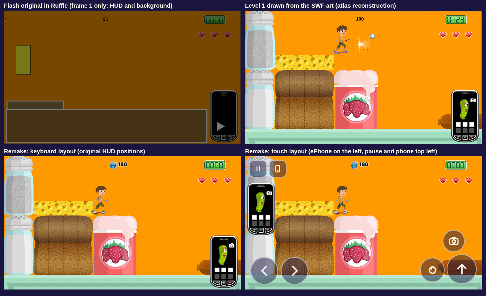

# Level 1: remake against the Flash original

## References

- **Gameplay captures of the original** (`reference/captures/ruffle-level1-*.png`): level 1 of
  the shipped `introductionToMicrobes_platformer.swf` played in Ruffle with real keys by
  `tools/ruffle/level1-review.cjs` (`NODE_PATH=/opt/node22/lib/node_modules node
  tools/ruffle/level1-review.cjs`):
  - `ruffle-level1-opening.png`: the opening view after the ePhone intro;
  - `ruffle-level1-intro-page2.png`: the ePhone briefing, page 2;
  - `ruffle-level1-photo-standing.png` and `ruffle-level1-photo-riding-right.png`: where the
    camera flash appears when standing and when riding right;
  - `ruffle-level1-portal-closed-tile-over-portal.png`: the exit portal behind the worktop.
- `platformer-standalone-frame1.png`: the SWF on its own, stopped on frame 1 (HUD only).
- The top-right panel of `level1-compare.png` is the older reconstruction from the atlases
  (`tools/swf-sheet/verify-atlas.mjs`, then `node tools/compare-level1.mjs`), kept for its
  side-by-side of the touch and keyboard layouts.

## HUD (Ruffle gameplay capture against the remake, keyboard layout)

| Element | Flash original (`ruffle-level1-opening.png`) | Remake | Match |
|---|---|---|---|
| Background | flat orange `#ff9900` with a 1 px dark outline | same colour, outline dropped | colour matches |
| Score | `score` clip at (674.8, 14.05), four digit clips | same clip and positions, counts up | yes |
| Hearts | three `heart` clips at y 71.7; `heart0` (left) is hidden first | same, left first; a lost heart bursts before it hides | yes |
| Timer | bold black Arial 16, left-aligned from x 335 ("176") | same font, colour and place; shows 180 from the start; the SWF's unused stopwatch sits to its left; red in the last 20 s | yes, plus the stopwatch |
| ePhone | bottom right with the goal picture and tick boxes, "e-Bug" wordmark | same art and place; the wordmark is removed (no third-party branding) | yes |
| Talkie box | present in the SWF, hidden in play | not drawn | yes (hidden in play) |

## Level and play (Ruffle gameplay captures against the remake)

- **Layout.** The opening view matches the capture: salt and pepper pots, cheese, loaf, the
  yoghurt pot and the sausage on the same 50 px grid, the worktop along the bottom and Harry on
  the start cell, his upper body already looping its `move` animation as in the original.
- **Camera flash.** Standing, the flash's registration point is about 55 px right of the
  player's box in both (`ruffle-level1-photo-standing.png`). Riding right, the original puts it
  at least 75 px ahead, because the avatar's live width includes the hoverboard exhaust; the
  remake now reads the same per-frame width (78.7 to 92.4 px in `accelerate_mid`).
- **Portal.** The worktop tiles are drawn over the exit portal's bottom edge, as in
  `ruffle-level1-portal-closed-tile-over-portal.png` (the ellipse is cut flat at y 400).
- **Briefing.** The ePhone grows over the undimmed level and HUD, and the page text is regular
  white Arial, as in `ruffle-level1-intro-page2.png`.

## Differences that are deliberate

- **Touch layout** (bottom right panel): on touch screens the ePhone moves to the left edge and the
  pause and phone buttons sit top left, because thumbs and the action buttons cover the bottom
  right. Keyboard play keeps the original layout.
- **Juice**: squash and stretch, particles, hit-stop, shake, sparkles flying to the ePhone, popups,
  the portal's glow and opening burst, the suck-in and iris at the end, sound and music. The 2009
  game was silent and had none of these.
- **Briefing**: the ePhone grows and shows the level's pages from the original art as before, with
  the text drawn by the remake in the original's Arial (translatable, prompts that name the
  player's own controls), plus Skip / Next buttons, page dots and a control hint.

See `web/NOTES-platformer-decisions.md` for every change and its reason.
